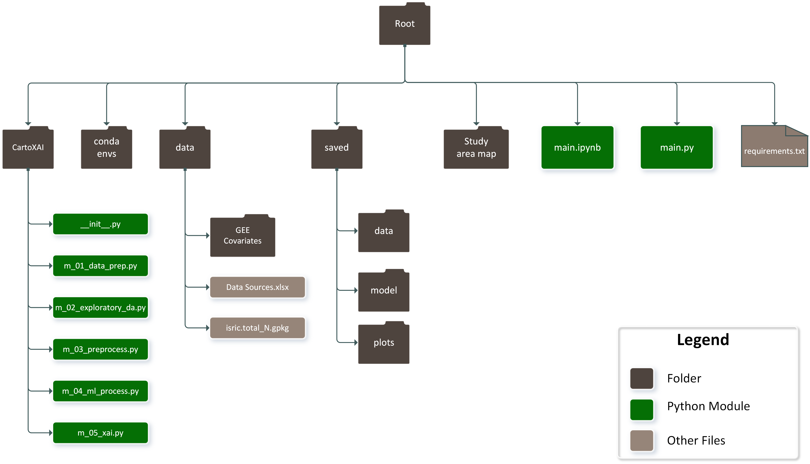

# International M.Sc. Cartography Thesis Source Code 
## Topic: Improving the understanding of Machine Learning predictions through maps

This repository is the source code developed in Python for the thesis topic above. It provides a detailed implementation regarding the technical steps involved in combining Machine Learning, Explainable Machine Learning, and Cartographic Visualizations to enhance the understanding of a black box model (Random Forest),
using Digital Soil Mapping as a case study.

**Keywords**: Digital Soil Mapping, Machine Learning, Explainable AI, SHAP, Interpretability, Map, Cartography

**Author**: [Isaac Newton Kissiedu](https://isaacnewtonfx.github.io)

**Cartography Program Cohort**: Intake 12th (2022 - 2024)

**Thesis Year**: 2024

**Thesis URL**: To be updated later

**Thesis Hosting Institution**: Technische Universität Dresden (TUD)

**Thesis Supervisor**: Dr.rer.nat. Nikolas Prechtel (TUD)

**Thesis Reviewer**: Prof. Ellen-Wien Augustijn (UT)

## **FOLDER STRUCTURE OVERVIEW**

## **FOLDER STRUCTURE DESCRIPTION**

1. **CartoXAI**:
This is the custom-developed python package that contains modules for performing different tasks based on the workflow explained in the thesis.
The __init__.py file is an empty module that converts the folder into a Python package so that the modules inside the package can be imported and used in other modules such as the main.ipynb or main.py.

3. **conda envs**:
This folder contains conda environment files that can be used to restore the same conda environment that was used for the development of the Python program.

5. **data**:
This folder contains the GEE extracted covariates in the form of CSV files, and the list of data sources in Excel.
The measured soil nitrogen and 1km grid inference data are also located under the sub-folder GEE Covariates. These are the raw datasets that are used as input during the data preparation.
The contents of this folder can be downloaded from [https://zenodo.org/records/12751114](https://zenodo.org/records/12751114)

7. **saved**:
This folder contains sub-folders including data, model and plots. During program execution, the data sub-folder is used to store important processed data files, the model sub-folder is used to store the trained ML and Explainable ML models, and the plots sub-folder is used to     store output plots and maps.

9. **Study area map**:
This folder contains a QGIS project file and spatial data for the preparation of the study area map. The contents of this folder can be downloaded from [https://zenodo.org/records/12788621](https://zenodo.org/records/12788621)

11. **main.ipynb** and **main.py**:
These modules are the entry point to the program. The main.ipynb is a Python notebook which is able to mix text with Python code, and also stores graphical outputs such as plots within the file. This provides an intuitive way of following the workflow for presentation and documentation purposes. On the other hand, the main.py is the classical type of Python module which does not support the advantages offered by the python notebook module.

13. **requirements.txt**:
This file contains the names of Python packages required to run the program. Without these dependencies, the program would not run successfully. Therefore it is necessary to make it available to aid the execution of the program on a different computer other than the one used for development.

## **HOW TO INSTALL**

The program was developed using Python version 3.9.13 and depends on Python packages listed in the requirements.txt file. In order to run the program, the Python packages must be installed first. These dependencies can be installed either into the default Python environment on the operating system or a virtual Python environment can be created purposely for running the program. The advantage of using a virtual Python environment is the ability to easily delete the environment when not in use.

**Installing dependencies into the default O/S Python environment**

If the operating system Python version is at least 3 and above, this option could be used. Otherwise, Python version 2 is not supported by the program and therefore a virtual Python environment must be installed which is outlined in the section below.

1.	Open the command prompt and navigate to the root folder. Execute the command >> pip in-stall -r requirements.txt
2.	Verify that the packages have been installed by executing the command >> pip list
3.	If a package fails to install, attempt to install it separately >> pip install package_name

**Installing dependencies into a virtual Python environment**

The virtual environment manager Anaconda or miniconda can be used. Anaconda offers a graphical user interface while miniconda does not. Therefore beginners may find Anaconda more user-friendly.

**To use Anaconda**:

1.	Download the Anaconda software according to the intended operating system from [https://www.anaconda.com/download](https://www.anaconda.com/download)
2.	Install the program.
3.	Launch Anaconda Navigator.
4.	From the Anaconda Navigator, select the Environments menu item.
5.	Click on the Create button. This should open the Create new environment dialog box.
6.	Enter Name as geoai or any other name. There should not be spaces in the name.
7.	Select Python version 3.9. If not available, select Python 3.8.
8.	Click on Create. This will take a while to create the Python environment. Once it is done, the Python environment would be automatically selected.
9.	Click on the Home menu.
10.	Click to install the CMD.exe Prompt from the Anaconda Navigator.
11.	Once installed, click to launch the CMD.exe Prompt. Notice that the Python environment is automatically activated within the command prompt.
12.	Use the cd command to navigate to the root folder of the Python program. If the Python program folder is on a different disk, switch to that disk first.
13.	Run the command >> pip install –r requirements.txt
14. If a certain package breaks the installation, comment it out in the requirements.txt file,
run step 13 again, and finally attempt to install the failed packages separately >> pip install package_name or conda install package_name or conda install package_name --channel conda-forge
16.	After a successful installation of all packages listed in the requirements.txt file, close the command prompt.

Advanced users can use the Import Menu under the Environments section of the Anaconda Navi-gator to import the conda-lock.yml file found under the "conda envs" folder to restore the development environment.

**To use miniconda**:

1. Install miniconda.
[https://conda.io/projects/conda/en/latest/user-guide/install/index.html](https://conda.io/projects/conda/en/latest/user-guide/install/index.html)
2. Use miniconda to create a Python virtual environment
[https://conda.io/projects/conda/en/latest/user-guide/tasks/manage-environments.html#activating-an-environment](https://conda.io/projects/conda/en/latest/user-guide/tasks/manage-environments.html#activating-an-environment)
3. Activate the virtual environment.
[https://conda.io/projects/conda/en/latest/user-guide/tasks/manage-environments.html#activating-an-environment](https://conda.io/projects/conda/en/latest/user-guide/tasks/manage-environments.html#activating-an-environment)
4. Navigate the root folder and run the command >> pip install -r requirements.txt
5. If a certain package breaks the installation, comment it out in the requirements.txt file, run step 4 again, and finally attempt to install the failed packages separately >> pip install pack-age_name or conda install package_name or conda install package_name --channel conda-forge
6. After a successful installation of all packages listed in the requirements.txt file, close the command prompt.

Advanced users can use the conda-lock.yml file found under the "conda envs" folder to restore the development environment using the command >> conda-lock install --name geoai "conda envs/conda-lock.yml". More details regarding conda-lock is available at [https://pythonspeed.com/articles/conda-dependency-management](https://pythonspeed.com/articles/conda-dependency-management)

## **HOW TO RUN THE PROGRAM**

Once the dependencies are installed, the program can be executed by running any of the entry point files main.py or main.ipynb. The main.ipynb is a Python notebook based on which the main.py file was created. Therefore the main.ipynb contains additional codes for debugging purposes. However, the two files produce the same results. It is also important to note that the inherent random nature of the Random Forest algorithm might influence slightly different patterns in subsequent runs of the program.

**To run the main.ipynb file**

To execute the main.ipynb file, the Anaconda or Visual Studio Code can be used. While using Anaconda is much easier, 
Visual Studio Code requires additional effort which would not be covered in this section but the details could be 
followed here [https://code.visualstudio.com/docs/datascience/jupyter-notebooks](https://code.visualstudio.com/docs/datascience/jupyter-notebooks). 

The following are the general steps to execute the program in Anaconda.

1.	Place the program folder on the desktop
2.	Launch Anaconda
3.	Select the Python virtual environment that was created above.
4.	Click to install the Jupyter Lab application within the Navigator.
5.	Browse to the Python program folder and double-click on the main.ipynb file
6.	Run the Import Packages cell
7.	In case a package is not found, launch the cmd.exe application from Anaconda and install the indicated package using pip or conda as indicated in the section above, and try again.
8.	Once all packages are imported, the remaining Python notebook cells are expected to run smoothly.

**To run the main.py file**

To execute the main.py file, the command prompt can be used as shown below.

1.	When using the default Python environment, open the Operating System command prompt and navigate to the Python program root folder.
Execute the command >> python main.py. Depending on the operating system and how the python interpreter is named,
the command could be python3 main.py, especially on linux and mac systems where both Python 2 and 3 exist.
3.	When using a virtual environment, first activate the virtual environment, then navigate to the root folder. Execute the command >> python main.py

## **HOW TO EXTEND THE PROGRAM FUNCTIONALITIES**

For entirely new functionality, create a new Python module under the CartoXAI package and define functions in it. Import the module into the main.py or main.ipynb file and execute the functionality. Functionalities could also be added to the pre-existing modules inside the CartoXAI package.

